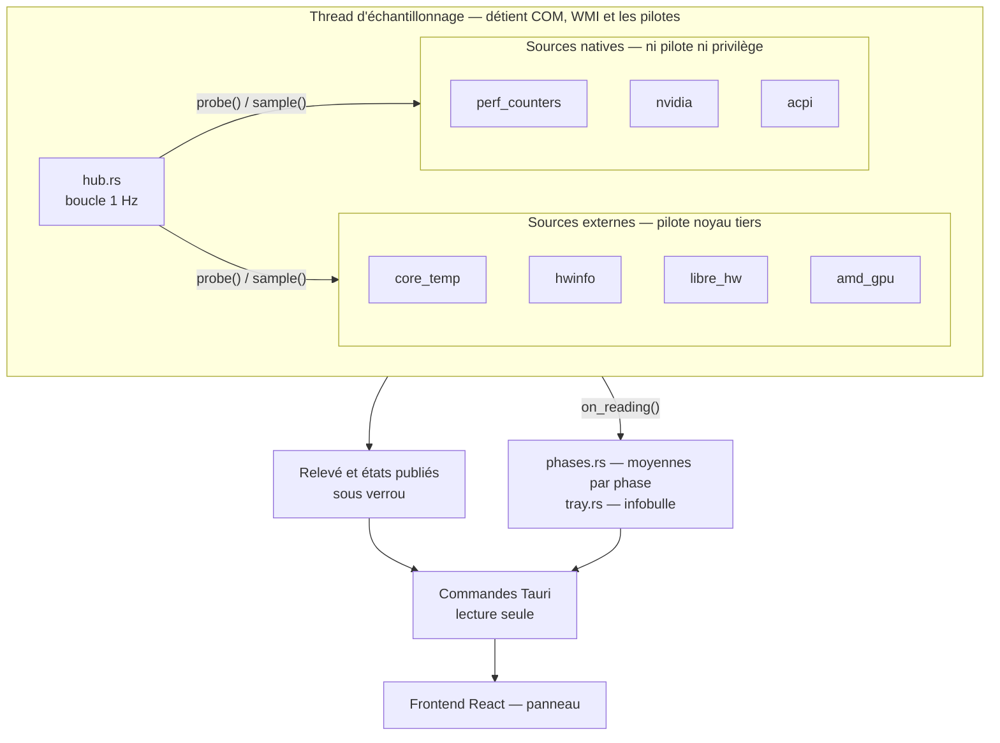
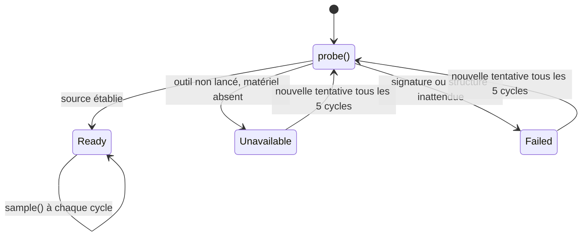
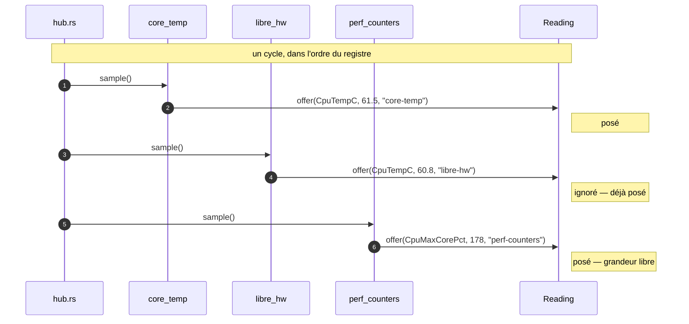

# Architecture

## Vue d'ensemble

Le relevé traverse trois étages : un thread d'échantillonnage qui détient toutes les
ressources natives, une zone publiée sous verrou, et les consommateurs qui ne font que
lire.



L'ordre du registre — sources externes d'abord — **est** la priorité d'arbitrage : voir
plus bas.

La branche `on_reading()` est ce qui rend l'application indépendante de sa fenêtre :
l'accumulation des moyennes et l'infobulle de l'icône suivent le rythme de la mesure, pas
celui du frontend. Voir [background-ux.md](background-ux.md).


## Les modules Rust

| Fichier | Responsabilité |
|---|---|
| `lib.rs` | les commandes exposées au frontend, et le câblage de l'application |
| `capabilities.rs` | ce que la machine permet, et pourquoi pas le reste |
| `tray.rs` | l'icône de la zone de notification : état, infobulle, menu |
| `flyout.rs` | le panneau : ancrage sur l'icône, masquage, épinglage |
| `phases.rs` | les moyennes par état du bridage, tenues au rythme de la mesure |
| `tools.rs` | les outils tiers : où ils sont, s'ils tournent, comment les lancer |
| `power.rs` | lecture registre + écriture `powercfg` du schéma actif |
| `sensors/metric.rs` | les grandeurs mesurables, et le relevé agrégé |
| `sensors/provider.rs` | le contrat que respecte toute source |
| `sensors/registry.rs` | quels fournisseurs, dans quel ordre de priorité |
| `sensors/hub.rs` | la boucle d'échantillonnage et l'état des sources |
| `sensors/wmi_context.rs` | accès WMI partagé : COM, connexions, décodage des variants |
| `sensors/shared_memory.rs` | mappage de sections nommées, partagé par deux pilotes |
| `sensors/providers/*.rs` | un pilote par fournisseur |

`wmi_context.rs` et `shared_memory.rs` sont des supports techniques, pas des sources :
ils n'existent que parce que plusieurs pilotes en ont besoin.

`sensors/` ne connaît ni Tauri ni l'UI, et cela reste vrai avec `on_reading` : le hub
appelle une fermeture, il ignore ce qu'elle fait. Tout ce qui touche à l'application
— icône, fenêtre, phases — est câblé dans `lib.rs`.

## Le contrat des fournisseurs

```rust
pub trait Provider {
    fn info(&self) -> ProviderInfo;                            // ce qu'il sait mesurer
    fn probe(&mut self, ctx: &ProbeContext<'_>) -> ProbeState; // tenter de s'établir
    fn sample(&mut self, out: &mut Reading);                   // alimenter le relevé
}
```

Pas de borne `Send` : les pilotes sont construits et utilisés sur le seul thread
d'échantillonnage, ce qui laisse l'un d'eux détenir un handle COM sans contorsion.

`ProbeState` distingue trois situations, et la distinction est porteuse de sens :

- `Ready` — opérationnel ;
- `Unavailable { reason, hint }` — absent pour une raison attendue. **Ce n'est pas une
  erreur** : un PC sans GPU NVIDIA, un outil non lancé. `hint` dit quoi faire ;
- `Failed { error }` — présent mais cassé : la source a répondu autre chose que prévu.
  C'est le cas qui signale un bug, typiquement une disposition mémoire qui a changé.



Une source `Ready` n'est jamais re-sondée : seules celles qui ne le sont pas retentent
leur chance, ce qui permet la reprise à chaud sans coût en régime établi.

## Résolution des conflits

Plusieurs fournisseurs savent mesurer la même grandeur — la température CPU est
revendiquée par Core Temp, HWiNFO et LibreHardwareMonitor. La règle est unique :

> **Le premier servi gagne.** `Reading::offer` ne remplace jamais une valeur déjà posée,
> et `registry::build()` retourne les fournisseurs par priorité décroissante.



Pas de score, pas de pondération, pas de cas particulier. Conséquences directes :

- changer la priorité = déplacer une ligne dans `registry.rs` ;
- un fournisseur qui échoue silencieusement laisse la place au suivant, puisqu'il n'a
  rien proposé ;
- une valeur non finie est refusée par `offer`, donc une source qui renvoie `NaN` ne
  bloque pas les suivantes. C'est testé.

L'ordre du registre est lui-même couvert par un test : les sources à pilote noyau doivent
précéder les natives, sans quoi une mesure approchée pourrait occuper la place d'une
mesure exacte.

## Provenance

Chaque valeur transporte l'identifiant du fournisseur qui l'a produite
(`Sample { value, provider }`), affiché sous chaque carte. Quand deux outils de monitoring
tournent en même temps, on sait lequel parle — sans quoi un écart entre deux sources
devient indébogable.

## Le relevé

`Reading` porte une `BTreeMap<Metric, Sample>` plutôt qu'une structure à champs nommés.
Ce choix est ce qui rend le pipeline agnostique : un nouveau pilote peut alimenter
n'importe quelle grandeur sans toucher au type, et le frontend itère sur ce qui est
présent au lieu de tester onze `Option`.

Le coût est une indirection à la lecture, absorbée côté TypeScript par `val(reading, m)`.

## Reprise à chaud

`hub.rs` retente `probe()` sur les sources non établies tous les 5 cycles. Lancer Core
Temp pendant que l'application tourne suffit donc à faire apparaître les températures,
sans redémarrage. Le frontend relit les capacités périodiquement pour refléter
ce changement.
