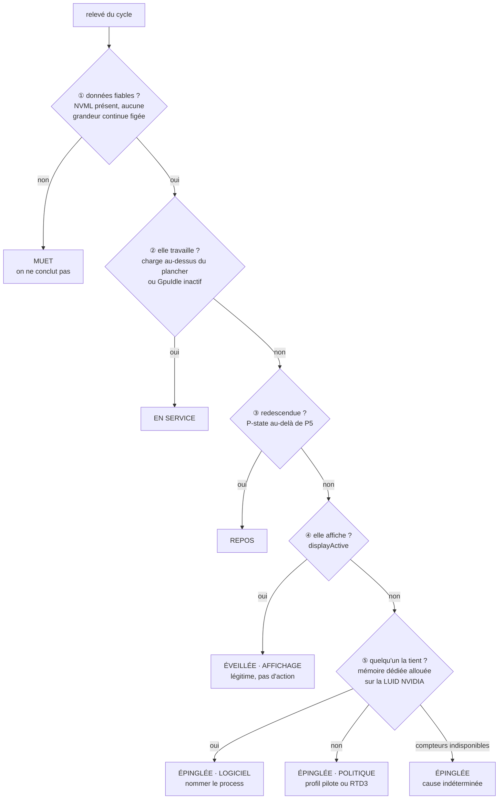
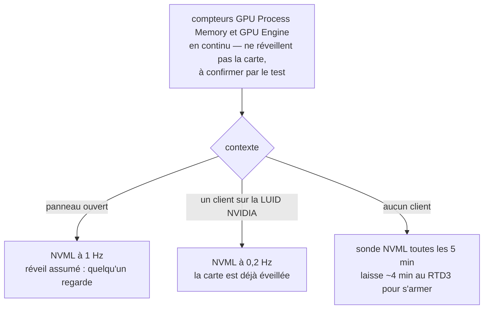

# Le GPU : lire son repos, agir sur sa consommation

> **Statut : diagnostic implémenté ; un actionneur, le verrou d'horloge au repos,
> implémenté et désactivé par défaut.** Le badge du GPU applique l'algorithme de décision
> ci-dessous ; ce qui en reste à faire est tenu à jour en fin de section. Les autres
> actionneurs restent des recommandations. Les relevés en fin de document sont mesurés ;
> le verrou n'a pas encore été vu à l'œuvre sur la machine de référence — voir « Le
> bridage au repos ».

Le point de départ est un cas réel, relevé sur le portable de contrepoint décrit dans
[measurement.md](measurement.md) : une RTX 2000 Ada qui consomme 18 W en continu, sans
écran attaché, sans client GPU, à 0 % d'utilisation. C'est l'anomalie que le badge
« épinglé » signale déjà. Reste à savoir quoi en faire.

## Le préalable : mesurer réveille

Chaque appel NVML exige que le périphérique soit en D0. **Interroger une carte en RTD3 la
sort de son état coupé**, et le pilote demande ensuite 30 à 60 s d'inactivité continue
avant de le réarmer.

À 1 Hz panneau ouvert, et même à 0,2 Hz replié, la carte ne se rendort donc jamais tant
que l'application tourne. Sur un portable, `thermal-lab` produit en permanence l'anomalie
qu'il prétend signaler.

C'est le piège documenté pour le plancher de charge dans [measurement.md](measurement.md),
transposé à l'instrument : là-bas la mesure ne permettait pas de conclure, ici elle
fabrique son propre résultat.

### Le test qui tranche

Avant toute implémentation, et parce qu'il conditionne le reste :

1. couper tout appel NVML pendant cinq minutes, ne relever que les compteurs PDH ;
2. faire **une** lecture NVML unique.

| Résultat | Conclusion |
|---|---|
| `power.draw` retombé sous 10 W, ou `N/A` | l'hypothèse tient : l'instrument est la cause, et la contrainte d'architecture ci-dessous s'impose |
| `power.draw` toujours vers 18 W | le blocage est ailleurs, l'instrument est hors de cause |

### La contrainte qui en découle

Il faut une source de battement **qui ne réveille pas la carte**. Les compteurs
`GPU Engine` de PDH sont alimentés par `dxgkrnl`, qui comptabilise l'ordonnancement côté
noyau sans solliciter le silicium — à confirmer par le test ci-dessus, mais c'est le seul
candidat natif.

Le schéma serait alors : PDH en continu à bas coût, NVML réveillé uniquement quand ces
compteurs montrent de l'activité, ou quand le panneau est ouvert. Le réveil devient une
dépense assumée, pas un effet de bord du cycle d'échantillonnage.

## Trois causes, trois actions différentes

Un GPU éveillé ne l'est pas toujours à tort. Confondre ces cas conduirait à proposer de
brider une carte qui fait son travail.

| Cause | Signature | Action |
|---|---|---|
| **Elle affiche** | `displayActive = Enabled` | aucune — MUX en mode discret, c'est du câblage |
| **Un logiciel la tient** | un process avec de la mémoire dédiée sur la carte | rediriger ce process vers l'iGPU |
| **Politique forcée** | `PowerMizerLevel` à 1, ou P-state épinglé sans les deux précédents | changer le profil pilote |

C'est la transposition directe du principe « politique et mesure sont deux choses » :
la mesure dit qu'il y a anomalie, l'algorithme ci-dessous dit laquelle, et seule la
troisième cause relève d'un interrupteur.

## L'algorithme de décision

Six issues, dans un ordre qui n'est pas indifférent.



La dernière flèche n'est pas une septième cause : l'anomalie est établie, seule sa cause
ne l'est pas. La taire reviendrait à cacher ce qu'on sait.

Passé ③ sans en sortir, la carte est **inoccupée et pourtant en état de performance** :
c'est l'anomalie. Les étapes suivantes ne disent plus s'il y en a une, mais laquelle.

### Pourquoi cet ordre

**① avant tout.** Ne jamais conclure sur une donnée absente : les trois grandeurs du
verdict — P-state, état d'affichage, `GpuIdle` — sont exigées ensemble, faute de quoi le
badge se tait. C'est le cas d'une carte AMD.

La détection de capteur figé, elle, ne porte sur aucune de ces trois : un booléen a le
droit de ne jamais changer, et un indice d'état n'est pas une grandeur continue. Elle
s'applique aux valeurs **affichées** — la fréquence en premier lieu — et n'accuse une
grandeur qu'à une condition : être restée identique pendant que la charge, elle, a
franchi les deux régimes. Sans variation de charge on ne conclut rien, une carte au repos
ayant le droit de rester à 210 MHz tout du long. La valeur suspecte reste affichée,
suffixée « figée ».

**② avant l'anomalie.** Une carte qui travaille explique tout. `GpuIdle` inactif compte
comme du travail : c'est le pilote qui déclare s'occuper de la carte, même quand
`utilization.gpu` affiche 0. La charge retenue est le maximum de `utilization.gpu`,
`.decoder` et `.encoder`, avec l'hystérésis 10 % / 20 % décrite dans
[measurement.md](measurement.md).

**③ avant ④.** Une carte redescendue va bien, même si elle pilote un écran. C'est aussi
ce qui sépare une carte *épinglée* d'une carte simplement *réveillée* — par notre propre
échantillonnage, entre autres.

**④ avant ⑤.** Une carte qui affiche est tenue par le compositeur, `dwm.exe`, qui y alloue
sa mémoire. Tester ⑤ en premier accuserait `dwm` sur toute machine dont le dGPU pilote un
écran.

**⑤ avant ⑥.** La cause politique ne se prouve pas : elle se conclut **par élimination**.
Tant que ⑤ n'est pas décidable, ⑥ ne l'est pas non plus — et c'est précisément la branche
du cas de référence.

### La mémoire allouée, pas la charge

Un process qui garde un device D3D ouvert suffit à interdire l'extinction, **sans rien
exécuter**. Relevé sur la machine de développement, au même instant :

| Process | Mémoire dédiée | Charge |
|---|---|---|
| pid 1288 | 151 Mo | **0,00 %** |
| pid 12948 | 180 Mo | **0,00 %** |
| pid 12684 | 116 Mo | 0,30 % |

Un critère fondé sur `GPU Engine\Utilization Percentage` n'aurait vu que le troisième. Le
critère de ⑤ est donc `GPU Process Memory(pid_*_luid_*)\Dedicated Usage` supérieur à zéro.
Les deux jeux de compteurs sont exposés en WMI
(`Win32_PerfFormattedData_GPUPerformanceCounters_*`), atteignables par le contexte déjà
utilisé pour les compteurs CPU, sans privilège.

### Filtrer sur la LUID de la carte

Chaque instance de compteur porte la LUID de son adaptateur. Sur un portable Optimus,
presque tous les process tiennent de la mémoire sur l'**iGPU**, sous une autre LUID. Sans
filtrer sur celle de la carte NVIDIA, ⑤ accuserait le bureau entier.

NVML ne donne pas la LUID ; le registre, si, sans dépendance nouvelle :

```
HKLM\SOFTWARE\Microsoft\DirectX\{GUID d'adaptateur}
  VendorId     REG_DWORD   0x10DE pour NVIDIA
  AdapterLuid  REG_QWORD   identique à celle des compteurs
```

Vérifié sur la machine de développement : `AdapterLuid = 0x15485` pour la carte,
`luid_0x00000000_0x00015485` dans les compteurs.

Deux précautions, toutes deux codées :

- **la LUID change** — `0x153fe` puis `0x15485` à deux jours d'écart, sur la même carte. Elle
  est relue à chaque cycle, jamais retenue ;
- **une entrée survit à son adaptateur.** Si la vieille LUID d'une entrée NVIDIA périmée a
  été réattribuée à l'iGPU, la garder ferait accuser ses clients. Toute LUID revendiquée
  aussi par un adaptateur d'un autre fournisseur est écartée : l'entrée vivante de cet
  adaptateur la réclame forcément.

Une LUID périmée qui ne collisionne avec rien est inoffensive : aucun process ne peut
tenir de mémoire sur un adaptateur disparu. Une seule requête de compteurs suffit donc,
sans interroger la liste des adaptateurs vivants.

### Quand interroger NVML

L'algorithme dit *quoi conclure*. Il faut une seconde règle pour *quand interroger*,
puisque chaque appel NVML sort la carte du RTD3 (voir « Le préalable : mesurer réveille »).



Le cas de référence tombe dans la dernière branche : aucun client, et pourtant 18 W. Une
sonde rare suffit à le détecter sans l'entretenir.

Cette règle ne vaut **que si** le test de l'effet observateur est positif. S'il est
négatif, l'échantillonnage actuel reste valable et cette sous-section est sans objet.

### De l'issue à l'actionneur

Chaque issue désigne son levier — c'est ce qui rend l'algorithme utile au-delà du
diagnostic.

| Issue | Actionneur |
|---|---|
| AFFICHAGE | aucun — c'est du câblage |
| LOGICIEL | préférence GPU **de ce process** vers l'iGPU (§ 1), sans privilège |
| POLITIQUE | NVAPI *Power management mode* (§ 2), puis *locked clocks* (§ 3), en dernier recours désactivation PnP (§ 4) |

### Ce que l'utilisateur voit

Sur la carte « Puissance GPU » :

| Issue | Badge | Note sous la valeur |
|---|---|---|
| MUET | — | fréquence |
| EN SERVICE | `en service` | fréquence |
| REPOS | `repos` | fréquence |
| AFFICHAGE | `affichage` | fréquence |
| LOGICIEL | **`épinglé`** | **`tenue par Discord.exe +34`** — la liste complète au survol, avec les tailles |
| POLITIQUE | **`épinglé`** | **`aucun client — politique pilote`** |
| cause indéterminée | **`épinglé`** | `cause indéterminée` |

Épinglée, la cause remplace la fréquence sous la valeur : c'est ce qu'il faut lire, et sur
les cartes concernées la fréquence n'est pas toujours une mesure.

### Ce qui reste à faire

| Élément | État |
|---|---|
| Étapes ① à ⑥ | ✅ |
| Détection de capteur figé | ✅ sur la fréquence affichée |
| Règle « quand interroger NVML » | ❌ suspendue au test de l'effet observateur |
| Verrou d'horloge au repos | ✅ désactivé par défaut — voir § 3 |
| Préférence GPU par application, NVAPI | ❌ |
| Drapeaux d'événement secondaires, `GpuPowerLimitW` | ❌ |

Le code : `gpuVerdict` dans `App.tsx` pour l'algorithme, `sensors/providers/gpu_holders.rs`
pour ⑤, `gpu_clamp.rs` pour le verrou — qui reprend l'énoncé du verdict côté Rust, parce
qu'il doit agir panneau replié, quand l'interface ne tourne pas. `cargo test gpu_holders -- --ignored --nocapture` liste les clients de la machine
courante.

## À lire en plus

Quatre grandeurs manquent à `Reading`, et chacune lève une ambiguïté rencontrée lors d'un
diagnostic manuel.

| Grandeur | Source | Ce qu'elle apporte |
|---|---|---|
| `GpuDisplayActive` | `nvmlDeviceGetDisplayActive` | sépare « éveillée pour rien » de « pilote un écran ». Sans elle, faux positif permanent sur tout portable à MUX discret |
| `GpuClockEventReasons` | `nvmlDeviceGetCurrentClocksEventReasons` | le pilote dit lui-même qu'il considère la carte au repos (`GpuIdle`). Plus direct que le couple fréquence / P-state |
| mémoire par process | compteurs `GPU Process Memory(pid_*_luid_*)` | **qui** tient le GPU éveillé — même à charge nulle, voir « La mémoire allouée, pas la charge ». NVML est structurellement aveugle à cette question sous WDDM : il ne voit que les contextes compute |
| `GpuPowerLimitW` | `nvmlDeviceGetEnforcedPowerLimit` | un dénominateur pour la puissance, comme `GpuClockMaxMhz` en donne un à la fréquence |

Les drapeaux d'événement secondaires (`SwPowerCap`, `HwSlowdown`, `DisplayClockSetting`)
sont gratuits une fois l'appel fait, et évitent d'attribuer au bridage une fréquence basse
qui vient d'un plafond thermique.

`GpuPowerLimitW` renvoie `N/A` sur la RTX 2000 Ada : c'est un cas `Unavailable`, pas
`Failed`.

## Les actionneurs

**Aucune API ne permet de forcer un GPU en RTD3.** C'est une décision du pilote, prise sur
des conditions qu'on ne peut qu'influencer. Tout ce qui suit consiste soit à retirer les
raisons qu'a la carte de rester éveillée, soit à plafonner ce qu'elle consomme quand elle
l'est.

### 1. Préférence GPU par application — le plus propre

```
HKCU\Software\Microsoft\DirectX\UserGpuPreferences
  <chemin complet de l'exécutable> = "GpuPreference=1;"   (REG_SZ)
```

| Valeur | Sens |
|---|---|
| `0` | Windows décide |
| `1` | économie d'énergie — iGPU |
| `2` | hautes performances — dGPU |

Documenté, réversible, **sans droits administrateur**. C'est ce qu'écrit Paramètres →
Affichage → Graphiques. Rediriger vers l'iGPU les applications qui n'ont rien à faire sur
la carte est ce qui permet réellement au RTD3 de s'armer.

Couplé aux compteurs par process, il devient possible de proposer la bascule sur le
coupable identifié. Sur un poste managé, c'est probablement le seul actionneur qui restera
disponible — et c'est le bon.

### 2. NVAPI, section DRS — le réglage absent du panneau NVIDIA

`NvAPI_DRS_CreateSession` → `LoadSettings` → `SetSetting` → `SaveSettings`, sur le profil
global ou un profil applicatif. Le réglage visé est *Power management mode*
(`PREFERRED_PSTATE`).

Écrire « Optimal power » par cette voie est strictement équivalent à ce qu'aurait fait
l'interface graphique, donc sans surprise et réversible. L'intérêt est qu'il reste
accessible **quand le panneau NVIDIA ne l'expose plus**, ce qui est le cas sur la machine
de référence.

> L'identifiant numérique du réglage est à prendre dans les en-têtes du SDK NVAPI, ou dans
> le `CustomSettingNames.xml` de NVIDIA Profile Inspector qui les recense. Ne pas le
> recopier de mémoire.

Prévoir l'échec : une stratégie d'entreprise peut verrouiller le profil. Cas `Unavailable`
avec un `hint` explicite.

### 3. NVML en écriture, sous élévation

| Appel | Effet | Pendant CPU |
|---|---|---|
| `nvmlDeviceSetGpuLockedClocks(min, max)` | plafonne la fréquence SM | `PROCTHROTTLEMAX` |
| `nvmlDeviceSetPowerManagementLimit` | plafonne l'enveloppe | — |

Contrairement aux *application clocks*, dépréciées sur GeForce et sur la machine de
référence, les *locked clocks* sont supportées depuis Turing sur une bonne partie des
cartes. Les deux appels échouent proprement en `NVML_ERROR_NOT_SUPPORTED` ailleurs — donc
capacité à **sonder à l'exécution**, jamais à déduire du nom de la carte.

#### Le bridage au repos — implémenté

`gpu_clamp.rs`, option « Brider le GPU quand il consomme pour rien » de l'onglet Système,
**décochée par défaut** : c'est une écriture dans le pilote graphique.

**La cible n'est pas codée en dur.** La carte déclare ses états de performance et la plage
d'horloge de chacun (`nvmlDeviceGetMinMaxClockOfPState`) ; le verrou vise l'état le plus
reposé qu'elle déclare. Relevé sur la machine de développement :

| État | Graphique | Mémoire |
|---|---|---|
| P0 | 210 – 3105 MHz | 11 501 MHz |
| P3 | 210 – 3105 MHz | 5 001 MHz |
| **P8** | **210 – 405 MHz** | **405 MHz** |

Le verrou mémoire n'existe que depuis Ampere : refusé, le verrou graphique reste seul.

**Quand.** Le même énoncé que le badge : pilote qui déclare la carte inoccupée, aucun
écran attaché, état de performance élevé, charge nulle — y compris celle du décodeur et de
l'encodeur. Trois relevés concordants avant de verrouiller ; **un seul** signe de travail
pour relâcher. Verrouillée, la carte redescend par notre fait : son état de performance
n'est plus consulté, seuls comptent la charge, le pilote et l'écran.

Une carte qui affiche n'est jamais touchée : verrouiller la mémoire d'une carte qui balaie
une dalle ferait des artefacts, et la clause d'affichage l'exclut de toute façon.

**Délai de relâchement.** La décision suit la mesure : une seconde panneau ouvert, cinq
replié. C'est le retard maximal au lancement d'un jeu, couvert par n'importe quel écran de
chargement.

**Garantie d'arrêt.** Même principe que pour le CPU : `gpu-clamp.json`, dans le dossier de
configuration, est écrit avant le verrou et retiré après. La sortie relâche ; un arrêt
brutal est soldé au lancement suivant, avant la première mesure. Sans journal possible,
pas de verrou. Les verrous tombent aussi d'eux-mêmes au redémarrage du pilote.

**Refus.** `NotSupported` ou `NoPermission` arrêtent les tentatives et s'affichent sous la
case ; la recocher les efface. Un autre échec est retenté au relevé suivant.

**Non vérifié sur la machine de référence.** Le verrou ne se déclenche que sans écran
attaché : sur la machine de développement il ne s'arme jamais. Deux inconnues restent :

- si le pilote de la RTX 2000 Ada accepte le verrou, ou répond `NotSupported` — la case le
  dira ;
- si le verrou fait baisser **la puissance** — seule mesure qui compte, `clocks.sm` étant
  figé sur cette carte. La carte « Puis. GPU » le montrera, et le badge passe à « bridé ».

Le chemin d'écriture se vérifie à part, dans une console élevée et sans jeu en cours :

```
cargo test verrouille_et_relache_la_vraie_carte -- --ignored --nocapture
```

`cargo test pstate_clock_ranges -- --ignored --nocapture` liste, sans rien écrire, les
états et plages de la carte courante.

### 4. Désactiver le périphérique PnP — l'option nucléaire

```powershell
Disable-PnpDevice -InstanceId 'PCI\VEN_10DE&...'   # réversible par Enable-PnpDevice
```

Sur une machine où le RTD3 ne s'arme jamais, c'est le **seul** moyen de réellement
supprimer les 18 W : le périphérique disparaît, Windows bascule tout sur l'iGPU. Admin
obligatoire.

Si elle est implémentée, la traiter à part : confirmation explicite, état affiché en
permanence, restauration automatique à la fermeture. C'est la seule entorse au principe
« quitter ne change rien » énoncé dans le README, et elle doit être assumée comme telle —
une application qui quitte en laissant le GPU désactivé est un incident, pas une
fonctionnalité.

### 5. Les clés PowerMizer du registre — à ne pas écrire

```
HKLM\SYSTEM\CurrentControlSet\Control\Class\{4d36e968-e325-11ce-bfc1-08002be10318}\<NNNN>
  PowerMizerEnable, PowerMizerLevel, PowerMizerLevelAC, PerfLevelSrc
```

Elles fonctionnent, mais ne prennent effet qu'au rechargement du pilote : ce n'est pas un
actionneur dynamique, c'est une configuration de déploiement.

**Les lire pour diagnostiquer** un forçage imposé par une image d'entreprise — c'est ce
qui expliquerait un panneau NVIDIA amputé de son réglage d'alimentation. Passer par NVAPI
pour écrire.

Attention à la requête : `reg query <classe> /s /f PowerMizer` parcourt des milliers de
sous-clés et paraît bloqué. Viser directement les sous-clés d'adaptateur, nommées `0000`,
`0001`, etc., et repérer la bonne par `DriverDesc`.

## Pièges

### La liste de processus de NVML ne prouve rien

`nvmlDeviceGetComputeRunningProcesses` ne remonte que les contextes CUDA. Sous WDDM, une
application qui tient un device D3D — et qui suffit à interdire l'extinction —
n'y apparaît **jamais**. Une liste vide n'est pas une absence de client.

La même prudence vaut pour `tasklist /m nvapi64.dll` sans élévation : les modules des
process SYSTEM ne sont pas visibles, et c'est précisément là que tournerait un agent de
supervision.

### Une valeur qui ne varie jamais n'est pas un capteur

Sur la machine de référence, `clocks.sm` renvoie 2115 MHz au MHz près en toutes
circonstances, alors que `power.draw` varie bien, lui, de 17,9 à 18,5 W. La première est
une valeur nominale recopiée par le pilote, la seconde une mesure.

Le critère est général et doit s'appliquer avant de conclure quoi que ce soit : faire
varier la charge, et vérifier que la grandeur bouge. Une télémétrie partiellement non
implémentée est la règle sur portable, pas l'exception.

### Le compteur par process peut mentir sur la taille

Relevé sur la machine de développement, WMI et PDH d'accord :

| Instance | Mémoire dédiée |
|---|---|
| `NVIDIA Overlay.exe` | **2 658 178 019 328 octets** — 2,66 To |
| l'adaptateur entier | 1 788 026 880 octets — 1,79 Go |

La présence reste vraie — le process tient bien la carte, 119 Mo engagés — pas la
quantité. Une taille qui dépasse deux fois le total de l'adaptateur est donc déclarée
inconnue : le process reste compté parmi les clients, mais n'est pas classé sur la foi
d'un chiffre faux. Sans cette borne, il passait en tête de liste.

La marge de deux tient à ce que les deux requêtes ne sont pas simultanées : un gros client
peut dépasser un instantané de l'adaptateur sans être faux. La valeur fautive le dépassait
1 500 fois.

### Une température ne prouve pas une activité

CPU et GPU partagent les mêmes caloducs sur un portable. Une carte électriquement coupée,
posée à côté d'un CPU qui travaille, se lit couramment autour de 50 °C. C'est la
température du châssis, pas une dissipation propre.

### `display_active` n'est pas `display_mode`

`display_mode` renvoie « deprecated » sur les pilotes récents ; `display_active` répond.
Et `DISPLAY` n'est pas un type valide pour `nvidia-smi -q -d` : passer par
`--query-gpu=display_active`.

## Relevés de référence

Portable Dell i9-13950HX / RTX 2000 Ada, sur batterie, écrans externes débranchés, bureau
Windows sans application active.

| Grandeur | Valeur |
|---|---|
| `pstate` | P0, parfois P3 |
| `clocks.sm` | 2115 MHz — constant en toutes circonstances |
| `clocks.max.sm` | 3105 MHz (plafond architectural de la génération, pas de la carte) |
| `power.draw` | 17,9 à 18,5 W, variable |
| `power.limit` | `N/A` |
| `temperature.gpu` | 52 °C |
| `utilization.gpu` | 0 % |
| `display_active` | **Disabled** |
| processus compute | aucun |
| colonnes GPU du gestionnaire des tâches | toutes à 0, moteur GPU vide |
| application clocks | « Requested functionality has been deprecated » |
| persistence mode | `N/A` |
| panneau NVIDIA | **pas de section Gestion de l'alimentation** |
| `clocks_event_reasons` | `GpuIdle` actif, tout le reste inactif |

Lecture : la carte est éveillée, ne pilote aucun écran, n'exécute rien, et consomme 18 W.
Le pilote lui-même la déclare au repos. L'absence du réglage d'alimentation dans le
panneau NVIDIA oriente vers un profil imposé par l'image système.

Deux hypothèses restent ouvertes, non départagées à ce jour, et le test de l'effet
observateur en tranche une :

1. l'échantillonnage NVML de l'outil de diagnostic empêche lui-même le RTD3 ;
2. le RTD3 est désactivé par le firmware ou une stratégie, ou un agent d'entreprise
   interroge le GPU en boucle.

Sur poste managé, `powercfg /requests` et `powercfg /energy` exigent l'élévation et n'ont
pas pu être exécutés — c'est la limite de ce qu'un utilisateur standard peut établir.

## Ce que ça donnerait à l'utilisateur

Le différenciateur n'est pas de plafonner : n'importe quel outil plafonne. C'est de
**nommer la cause**.

> Votre carte graphique consomme 18 W, aucun écran ne lui est attaché, et voici le
> processus qui la tient éveillée.

Les compteurs par process et `displayActive` suffisent à produire cette phrase, et aucun
des deux ne demande de privilège.
