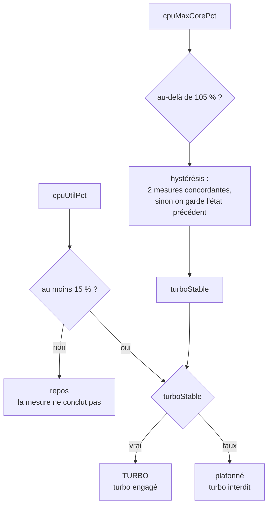

# Ce que valent les chiffres

Toutes les valeurs de ce document ont été mesurées sur la machine de développement :
i9-14900K (24 cœurs, 32 threads, nominal 3200 MHz), RTX 4080 SUPER, ASUS ProArt
Z790-CREATOR WIFI, Windows 11 Pro 26200.

## La mesure décisive n'est pas une température

`PercentProcessorPerformance` exprime la fréquence en pourcentage du nominal. Au-delà de
100, le turbo est engagé. C'est ce qui prouve l'effet du bridage, **sans aucune sonde
thermique** — donc sans pilote noyau, donc partout.

| État | Cœur le plus rapide |
|---|---|
| Bridé (`PROCTHROTTLEMAX = 99`) | ≤ ~99 % |
| Libre, sous charge | jusqu'à **178 %** (≈5,7 GHz) |

La température n'est que la conséquence. Un déploiement sans fournisseur externe perd la
démonstration de l'effet, pas celle du mécanisme.

## Pourquoi le maximum par cœur, et pas la moyenne

L'instance `_Total` des compteurs mélange les 32 processeurs logiques. Mesuré au repos,
sur 40 échantillons à 400 ms :

```
min = 34   max = 110   moyenne = 54
1 seul échantillon au-dessus de 100
```

Un badge calculé sur cette moyenne clignote : elle stagne vers 50 et ne franchit 100 que
lorsqu'un cœur boost assez fort pour tirer l'ensemble. Le signal utile est noyé dans 31
cœurs au repos.

Le maximum par cœur sépare franchement les deux régimes — ~99 contre 178 — d'où le seuil
à **105 %**, loin des deux.

## Pourquoi un plancher de charge

Au repos, le CPU boost par à-coups d'une fraction de seconde au moindre réveil de thread.
Sur 20 passes à 500 ms, machine inactive :

```
cœur max : 87 87 97 173 101 129 100 89 65 66 152 74 63 70 79 115 88 70 46 64
charge   : 0 à 17 %
```

4 passes sur 20 dépassent 105 %. **L'absence de turbo au repos ne prouve rien** : ne pas
voir un cœur booster ne veut pas dire qu'il en est empêché.

D'où trois états au lieu de deux, avec `LOAD_FLOOR_PCT = 15` :

| Charge | Cœur max | Badge | Sens |
|---|---|---|---|
| < 15 % | — | **repos** | la mesure ne permet pas de conclure |
| ≥ 15 % | > 105 % | **TURBO** | turbo engagé |
| ≥ 15 % | ≤ 105 % | **plafonné** | turbo effectivement interdit |

Une hystérésis de deux mesures concordantes stabilise l'affichage.

Les deux garde-fous n'agissent pas au même endroit, et l'ordre compte : l'hystérésis
lisse la mesure de fréquence, le plancher de charge décide ensuite si cette mesure a le
droit de conclure.



## Politique et mesure sont deux choses

L'interrupteur du haut porte la **politique**, lue dans le schéma d'alimentation. Le badge
porte ce que la **mesure** observe. Elles divergent légitimement : un CPU bridé au repos
n'engage aucun turbo, ce qui ne dit rien de la politique.

Les confondre a produit deux bugs successifs — un badge clignotant, puis un badge
« bridé » alors que rien ne bridait. Le vocabulaire de la politique ne doit pas servir à
nommer un état mesuré.

## Températures : ce que chaque source mesure

| Source | Mesure | Valeur relevée simultanément |
|---|---|---|
| Core Temp | die CPU, maximum des cœurs | **61,5 °C** |
| Zone ACPI | un point de la carte mère | **27,9 °C** |

L'écart n'est pas une erreur : ce ne sont pas les mêmes grandeurs. C'est pourquoi
`BoardTempC` est une métrique distincte de `CpuTempC` et ne peut pas s'y substituer.

## Puissance : la mesure qui explique la pièce

Core Temp publie aussi la puissance package — **82,8 W** au repos, turbo libre. En charge
sans bridage, un 14900K dépasse 250 W ; bridé, il reste vers 80-100 W.

Ces ~200 W d'écart sont littéralement le radiateur qu'on supprime de la pièce. La
température explique le CPU, la puissance explique les degrés ambiants.

## Comparaison de phases

`phases.ts` accumule des moyennes séparées selon l'état du bridage. La comparaison n'a de
sens qu'**à charge comparable** : basculer pendant un écran de chargement ou un menu
fausse les moyennes. Basculer en jeu, sur une scène stable.

Le compteur de secondes par phase est affiché pour repérer une phase trop courte pour être
significative.
