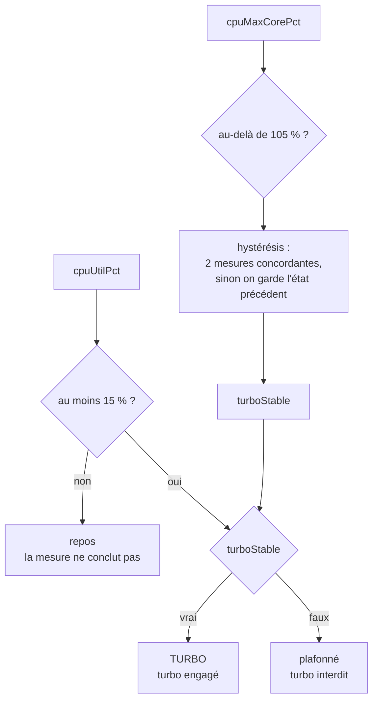

# Ce que valent les chiffres

Sauf mention contraire, les valeurs de ce document ont été mesurées sur la machine de
développement : i9-14900K (24 cœurs, 32 threads, nominal 3200 MHz), RTX 4080 SUPER,
ASUS ProArt Z790-CREATOR WIFI, Windows 11 Pro 26200.

Une seconde machine sert de contrepoint là où le comportement d'un portable diffère de
celui d'une tour : Dell mobile i9-13950HX, RTX 2000 Ada, dont CPU et GPU partagent les
mêmes caloducs.

## La mesure décisive n'est pas une température

`PercentProcessorPerformance` exprime la fréquence en pourcentage du nominal. Au-delà de
100, le turbo est engagé. C'est ce qui prouve l'effet du bridage, **sans aucune sonde
thermique** — donc sans pilote noyau, donc partout.

| État | Cœur le plus rapide |
|---|---|
| Bridé (`PROCTHROTTLEMAX = 99`) | ≤ ~99 % |
| Libre, sous charge | jusqu'à **178 %** (≈5,7 GHz) |

La température n'est que la conséquence. Un déploiement sans fournisseur externe perd la
démonstration de l'effet, pas celle du mécanisme.

## Pourquoi le maximum par cœur, et pas la moyenne

L'instance `_Total` des compteurs mélange les 32 processeurs logiques. Mesuré au repos,
sur 40 échantillons à 400 ms :

```
min = 34   max = 110   moyenne = 54
1 seul échantillon au-dessus de 100
```

Un badge calculé sur cette moyenne clignote : elle stagne vers 50 et ne franchit 100 que
lorsqu'un cœur boost assez fort pour tirer l'ensemble. Le signal utile est noyé dans 31
cœurs au repos.

Le maximum par cœur sépare franchement les deux régimes — ~99 contre 178 — d'où le seuil
à **105 %**, loin des deux.

## Pourquoi un plancher de charge

Au repos, le CPU boost par à-coups d'une fraction de seconde au moindre réveil de thread.
Sur 20 passes à 500 ms, machine inactive :

```
cœur max : 87 87 97 173 101 129 100 89 65 66 152 74 63 70 79 115 88 70 46 64
charge   : 0 à 17 %
```

4 passes sur 20 dépassent 105 %. **L'absence de turbo au repos ne prouve rien** : ne pas
voir un cœur booster ne veut pas dire qu'il en est empêché.

D'où trois états au lieu de deux, avec `LOAD_FLOOR_PCT = 15` :

| Charge | Cœur max | Badge | Sens |
|---|---|---|---|
| < 15 % | — | **repos** | la mesure ne permet pas de conclure |
| ≥ 15 % | > 105 % | **TURBO** | turbo engagé |
| ≥ 15 % | ≤ 105 % | **plafonné** | turbo effectivement interdit |

Une hystérésis de deux mesures concordantes stabilise l'affichage.

Les deux garde-fous n'agissent pas au même endroit, et l'ordre compte : l'hystérésis
lisse la mesure de fréquence, le plancher de charge décide ensuite si cette mesure a le
droit de conclure.


```mermaid
flowchart TD
    mc["cpuMaxCorePct"] --> seuil{"au-delà de 105 % ?"}
    seuil --> hyst["hystérésis :<br/>2 mesures concordantes,<br/>sinon on garde l'état précédent"]
    hyst --> stable["turboStable"]

    util["cpuUtilPct"] --> plancher{"au moins 15 % ?"}
    plancher -->|non| repos["repos<br/>la mesure ne conclut pas"]
    plancher -->|oui| lire{"turboStable"}
    stable --> lire
    lire -->|vrai| turbo["TURBO<br/>turbo engagé"]
    lire -->|faux| plaf["plafonné<br/>turbo interdit"]
```

## Le GPU au repos : ce que dit le badge

Sur un portable, CPU et GPU partagent les mêmes caloducs. Un GPU qui consomme sans rien
produire chauffe le die CPU **sans qu'aucune mesure CPU ne l'explique** : la température
monte, la puissance package ne bouge pas. C'est la lecture que l'interface doit rendre
possible.

### Trois clauses, et pourquoi la fréquence n'en fait pas partie

L'anomalie tient en une phrase, et chaque morceau en est une clause :

> le pilote déclare la carte inoccupée, **aucun écran ne lui est attaché**, et pourtant
> elle se tient dans un état de performance.

| Clause | Grandeur | Ce qu'elle écarte |
|---|---|---|
| le pilote la dit inoccupée | `GpuDriverIdle` (`GpuIdle`) | une carte qui travaille sans que `utilization.gpu` le montre |
| aucun écran attaché | `GpuDisplayActive` | le cas **légitime** : une carte qui balaie une dalle est éveillée à bon droit |
| état de performance | `GpuPerfStateIndex` ≤ **P5** | une carte simplement *réveillée*, y compris par notre propre sondage |

Les trois sont exigées ensemble. Une seule manquante et l'énoncé ne tient plus : le badge
se tait plutôt que de conclure sur une phrase incomplète — cas d'une carte AMD, qui ne
publie ni P-state ni état d'affichage.

Ces clauses établissent **qu'il y a** anomalie. Dire **laquelle** — un process qui tient la
carte, ou une politique du pilote — est l'affaire de l'algorithme de décision, décrit avec
son ordre et ses pièges dans [gpu-power-control.md](gpu-power-control.md).

Relevé simultané, au repos, les deux machines :

| Carte | `GpuIdle` | Écran attaché | P-state | Verdict |
|---|---|---|---|---|
| RTX 4080 SUPER (tour) | actif | **oui** | P8 | repos — deux clauses la sauvent |
| RTX 2000 Ada (portable) | actif | **non** | P0 ou P3 | **épinglé** |

La clause d'affichage n'est pas un détail : sans elle, tout portable dont le MUX est en
mode discret serait signalé en permanence, alors que sa carte fait exactement son travail.

#### La fréquence a été retirée du verdict

Elle y a figuré, et c'était une erreur de deux façons.

D'abord le dénominateur. Les deux cartes annoncent `clocks.max.sm = 3105 MHz` — une 4080
SUPER de bureau et une RTX 2000 Ada mobile n'ont évidemment pas le même boost :
`clocks.max.sm` rapporte le plafond **architectural de la génération**, pas celui de la
carte.

Ensuite, et c'est rédhibitoire : sur la RTX 2000 Ada, `clocks.sm` renvoie **2115 MHz au
MHz près en toutes circonstances**, quand `power.draw` varie bien, lui, de 17,9 à 18,5 W.
La première est une valeur nominale recopiée par le pilote, la seconde une mesure. Le
rapport y valait donc 68 % en permanence : « épinglé » quoi qu'il arrive — juste par
accident sur cette machine, aveugle par construction. Uni aux autres par un **OU**, il ne
pouvait même pas être contredit.

**Une valeur qui ne varie jamais n'est pas un capteur.** Le critère s'applique avant de
conclure quoi que ce soit : faire varier la charge, et vérifier que la grandeur bouge. Une
télémétrie partiellement non implémentée est la règle sur portable, pas l'exception.

La fréquence reste affichée sous la puissance GPU, rapportée au plafond. Elle informe,
elle ne juge plus.

> Deux corrections successives ont traversé cette section : un plafond de ~2115 MHz
> déduit et présenté comme mesuré, puis le rapport lui-même. Elles sont consignées plutôt
> qu'effacées — c'est le même raisonnement qui menace de se refaire.

#### Une réserve qui reste ouverte

Chaque appel NVML exige que la carte soit en D0 : **l'interroger la sort du RTD3**, et le
pilote demande ensuite 30 à 60 s d'inactivité continue avant de le réarmer. Sur un
portable, l'application entretient donc l'éveil qu'elle mesure.

La clause de P-state limite les dégâts — une carte seulement réveillée par un sondage
retombe en P8, là où une carte épinglée par une politique se tient en P0 ou P3 — mais elle
ne referme pas la question. Voir [gpu-power-control.md](gpu-power-control.md) pour le test
qui la tranche, et les conséquences d'architecture qui en découleraient.

### Pourquoi le décodage vidéo compte comme une charge

`utilization.gpu` reste bas pendant une lecture vidéo : le travail est fait par les
moteurs dédiés, NVDEC et NVENC, qui ont leurs propres compteurs. Une vidéo en plein écran
passerait donc pour un repos — et un GPU qui décode n'a rien d'épinglé.

La charge retenue est le **maximum des trois** : `utilization.gpu`,
`utilization.decoder`, `utilization.encoder`. Le garde-fou précède volontairement
l'actionneur : le jour où un bridage s'appuiera sur ce prédicat, brider pendant une
lecture vidéo coûterait des images perdues.

### Les badges

| Badge | Couleur | Sens |
|---|---|---|
| **en service** | `idle` | la carte travaille — charge, ou `GpuIdle` inactif. Rien à conclure |
| **repos** | `cool` | redescendue dans un état profond |
| **affichage** | `idle` | éveillée pour piloter un écran : coûteux, mais légitime |
| **épinglé** | `hot` | **consomme sans rien produire** — la note dit pourquoi |

Les couleurs gardent le sens qu'elles ont pour le CPU : `hot` l'état coûteux, `cool`
l'état économe, `idle` celui où la mesure ne permet pas de conclure sur un gaspillage. À
noter que « repos » est ici l'état *souhaitable*, là où pour le CPU il marque l'absence de
conclusion — c'est le badge qui change de sens, pas la couleur.

Mêmes garde-fous que pour le turbo, pour les mêmes raisons : hystérésis de deux mesures
concordantes sur le verdict, et deux seuils de charge (10 % / 20 %) pour ne pas osciller
sur le jitter du repos.

### Ce que ce badge aurait évité

Fréquence et charge GPU étaient **déjà collectées et déjà affichées** avant ce badge : ce
qui manquait n'était pas la donnée mais son interprétation. Un diagnostic mené à la main
sur un portable a demandé sept échanges pour établir ce que ces trois états donnent d'un
coup d'œil.

La suite de ce diagnostic a montré que ces deux grandeurs ne suffisaient pas — l'une
d'elles n'était même pas une mesure sur la machine concernée. `GpuDisplayActive` et
`GpuDriverIdle`, ajoutées ensuite, rendent l'énoncé vrai plutôt que vraisemblable ; les
compteurs de mémoire par process lui donnent un coupable.

## Politique et mesure sont deux choses

L'interrupteur du haut porte la **politique**, lue dans le schéma d'alimentation. Le badge
porte ce que la **mesure** observe. Elles divergent légitimement : un CPU bridé au repos
n'engage aucun turbo, ce qui ne dit rien de la politique.

Les confondre a produit deux bugs successifs — un badge clignotant, puis un badge
« bridé » alors que rien ne bridait. Le vocabulaire de la politique ne doit pas servir à
nommer un état mesuré.

## Températures : ce que chaque source mesure

| Source | Mesure | Valeur relevée simultanément |
|---|---|---|
| Core Temp | die CPU, maximum des cœurs | **61,5 °C** |
| Zone ACPI | un point de la carte mère | **27,9 °C** |

L'écart n'est pas une erreur : ce ne sont pas les mêmes grandeurs. C'est pourquoi
`BoardTempC` est une métrique distincte de `CpuTempC` et ne peut pas s'y substituer.

## Puissance : la mesure qui explique la pièce

Core Temp publie aussi la puissance package — **82,8 W** au repos, turbo libre. En charge
sans bridage, un 14900K dépasse 250 W ; bridé, il reste vers 80-100 W.

Ces ~200 W d'écart sont littéralement le radiateur qu'on supprime de la pièce. La
température explique le CPU, la puissance explique les degrés ambiants.

## Comparaison de phases

`phases.rs` accumule des moyennes séparées par phase : la machine libre, chaque profil,
et un bridage qu'aucun profil ne décrit — posé par un outil tiers — qui ne se mêle pas
aux moyennes d'un profil. La phase se lit dans l'état relu du schéma, jamais dans
l'intention de l'utilisateur. La comparaison n'a de
sens qu'**à charge comparable** : basculer pendant un écran de chargement ou un menu
fausse les moyennes. Basculer en jeu, sur une scène stable.

Le compteur de secondes par phase est affiché pour repérer une phase trop courte pour être
significative.
